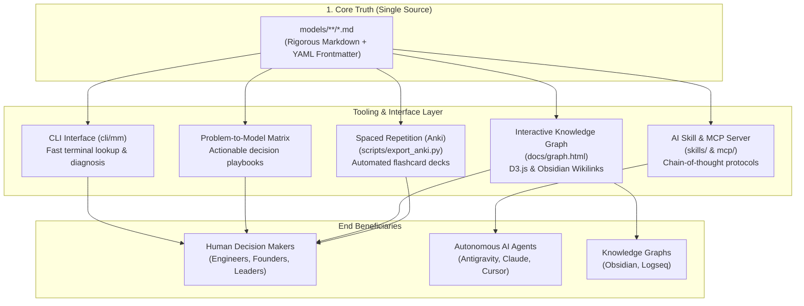

# The Mental Models Latticework

[](LICENSE)
[](models/)
[](#architecture--design-philosophy)
[](mcp/)
[](scripts/validate_models.py)

> **"You can't really know anything if you just remember isolated facts and try and bang 'em back. If the facts don't hang together on a latticework of theory, you don't have them in a usable form."**

An open-source, multidisciplinary knowledge base and decision-support system synthesizing foundational models across physics, evolutionary biology, economics, cognitive psychology, operations research, and mathematics.

Designed from first principles to serve both **human decision-makers** and **autonomous AI agents** without fragmentation.

---

## 🧭 The 5 Pillars of Utility



### 1. The Human Decision Playbook & Problem-to-Model Matrix
Every model file contains a field-tested **Diagnostic Checklist** and **Real-World Case Studies** (Technology, Business, High-Stakes Decisions). When facing a dilemma, consult the matrix below:

| If You Are Facing... | Consult Primary Model | Complementary Pair | Counter-Balance |
| :--- | :--- | :--- | :--- |
| **Deleting or refactoring legacy systems** | [[Chesterton's Fence]] | [[First-Principles Thinking]] | [[Second-Order Thinking]] |
| **Big-bang rewrites vs incremental evolution** | [[Gall's Law]] | [[Theory of Constraints]] | [[Chesterton's Fence]] |
| **High-stakes risk with asymmetric downside** | [[Ergodicity & Absorbing Barriers]] | [[Inversion]] | [[Margin of Safety]] |
| **Runaway positive or negative spirals** | [[Feedback Loops]] | [[Network Effects]] | [[Theory of Constraints]] |
| **Prioritizing roadmap or capital allocation** | [[Opportunity Cost]] | [[Expected Value]] | [[Comparative Advantage]] |
| **Resource allocation across fat tails** | [[Power Laws & The Pareto Principle]] | [[Asymmetric Payoffs]] | [[Theory of Constraints]] |
| **Slow organizational delivery & backlogs** | [[Theory of Constraints]] | [[Feedback Loops]] | [[Leverage]] |
| **Interpersonal friction or vendor breakages** | [[Hanlon's Razor]] | [[Occam's Razor]] | [[Proximate vs Root Cause]] |
| **Rapid competitor adaptation or arms race** | [[The Red Queen Effect]] | [[The OODA Loop]] | [[Economic Moats]] |
| **Hesitation to cut losses on failing projects** | [[Sunk Cost Fallacy]] | [[Loss Aversion]] | [[Opportunity Cost]] |
| **Uncertain forecasts or planning fallacies** | [[Base Rate Fallacy]] | [[Map vs Territory]] | [[Anchoring & Adjustment]] |
| **Designing systems under hostile volatility** | [[Antifragility]] | [[Defense in Depth]] | [[Margin of Safety]] |
| **Shared platform or multi-tenant degradation** | [[Tragedy of the Commons]] | [[Goodhart's Law]] | [[Principal-Agent Problem]] |
| **Navigating live crises under incomplete data** | [[The Fog of War]] | [[The OODA Loop]] | [[Margin of Safety]] |
| **Hiring, credentials, and counterfeit claims** | [[Costly Signaling & The Handicap Principle]] | [[Circle of Competence]] | [[Principal-Agent Problem]] |

---

### 2. AI Agent Reasoning Engine (Skill & MCP Server)
Models are machine-readable with strict YAML frontmatter and dedicated **AI Agent Reasoning Protocols**.
- **Antigravity Skill**: Located at [`skills/mental-models/SKILL.md`](skills/mental-models/SKILL.md). Equip your agent to run multi-model debiasing passes before major refactors.
- **Model Context Protocol (MCP)**: Run [`mcp/server.py`](mcp/server.py) over stdio with Claude Desktop, Cursor, or Antigravity:
  ```json
  {
    "mcpServers": {
      "mental-models": {
        "command": "python3",
        "args": ["/path/to/mental-models/mcp/server.py"]
      }
    }
  }
  ```

---

### 3. "The Latticework" Knowledge Graph
Models do not exist in isolation. Every file connects to others via standard wikilinks (`[[Model Name]]`), compatible with **Obsidian** and **Logseq**.
- **Interactive Force-Directed Graph**: Open [`docs/graph.html`](docs/graph.html) directly in any browser for an interactive D3.js visualization showing **100 interconnected nodes and 307 cross-disciplinary links**.
- **Regenerate Graph**:
  ```bash
  python3 scripts/generate_graph.py
  ```

---

### 4. Zero-Dependency Terminal CLI (`mm`)
Quickly search, diagnose, and review models from your terminal with zero external pip dependencies:

```bash
# List all 100 models organized by category
./cli/mm list

# Search models across titles, summaries, and triggers
./cli/mm search "uncertainty"

# Diagnose a strategic or technical problem statement
./cli/mm diagnose "Our team wants to replace a legacy billing service"

# Show complete details, checklist, and triggers for a model
./cli/mm show chestertons-fence

# Pull a random model for daily reflection
./cli/mm random
```

---

### 5. Spaced Repetition (Anki Flashcards)
Internalize models into long-term intuition. The automated export script extracts conceptual mechanisms and diagnostic scenarios into ready-to-import Anki cards:

```bash
python3 scripts/export_anki.py
```
Outputs `exports/mental_models_anki.tsv` containing **200 flashcards** ready for 1-click import into Anki Desktop / Mobile.

---

## 📚 Categorized Library Index (100 Models)

### 🧠 Core Thinking & Reasoning (18 Models)

- [Abductive Reasoning (Inference to the Best Explanation)](models/core_thinking/abductive-reasoning.md): The form of logical inference that starts with an incomplete set of observations and forms the most likely, parsimonious,...
- [Chesterton's Fence](models/core_thinking/chestertons-fence.md): The principle that reforms, deletions, or removals of existing structures, rules, or code should never be made until the...
- [Circle of Competence](models/core_thinking/circle-of-competence.md): The practice of identifying the realistic boundaries of your genuine knowledge and expertise, ruthlessly operating within...
- [Falsifiability](models/core_thinking/falsifiability.md): The principle that for any hypothesis, theory, or statement to be considered genuinely scientific or predictive, it must be...
- [First-Principles Thinking](models/core_thinking/first-principles.md): The practice of deconstructing a problem down to its most fundamental, irreducible truths and building up a solution from...
- [Hanlon's Razor](models/core_thinking/hanlons-razor.md): Never attribute to malice that which is adequately explained by carelessness, ignorance, incompetence, or cognitive overload.
- [Inversion](models/core_thinking/inversion.md): The practice of approaching problems backwards, focusing on avoiding failure, catastrophe, and stupidity rather than...
- [Lateral Thinking](models/core_thinking/lateral-thinking.md): The practice of solving problems through an indirect, non-linear, and creatively diagonal approach, deliberately stepping...
- [The Lindy Effect](models/core_thinking/lindy-effect.md): The theory that the future life expectancy of non-perishable entities (technologies, books, ideas, institutions) is...
- [Map vs. Territory](models/core_thinking/map-vs-territory.md): The fundamental realization that an abstraction, model, diagram, or metric of reality is not the reality itself, and that...
- [Necessary vs. Sufficient Conditions](models/core_thinking/necessary-vs-sufficient.md): The fundamental logical distinction between a condition that must be present for an event to occur (necessary) and a...
- [Occam's Broom](models/core_thinking/occams-broom.md): The intellectually dishonest practice where an advocate or theorist subtly sweeps inconvenient, contradictory facts and...
- [Occam's Razor](models/core_thinking/occams-razor.md): Among competing hypotheses or design solutions that predict or achieve identical outcomes, the one requiring the fewest...
- [Proximate vs. Root Cause](models/core_thinking/proximate-vs-root-cause.md): The crucial distinction between the immediate, surface event that triggered a failure (proximate cause) and the deeper,...
- [Reductio ad Absurdum](models/core_thinking/reductio-ad-absurdum.md): The method of disproving a proposition or architectural claim by demonstrating that its logical consequences, when followed...
- [Second-Order Thinking](models/core_thinking/second-order-thinking.md): The discipline of evaluating decisions not just by their immediate, intended consequences, but by the subsequent ripple...
- [Steelmanning (The Principle of Charity)](models/core_thinking/steelmanning.md): The practice of constructing the strongest, most compelling possible version of your opponent's or alternative's argument...
- [Thought Experiments (Gedankenexperiment)](models/core_thinking/thought-experiments.md): The practice of exploring the implications of an idea, hypothesis, or paradox using pure disciplined mental visualization...

### 🔄 Systems & Complexity (15 Models)

- [Antifragility](models/systems_complexity/antifragility.md): The property of systems that increase in capability, resilience, or robustness as a consequence of stressors, volatility,...
- [Ashby's Law of Requisite Variety](models/systems_complexity/ashby-requisite-variety.md): The cybernetic law stating that for a control system or organization to maintain stability and deal effectively with...
- [Braess's Paradox](models/systems_complexity/braess-paradox.md): The counter-intuitive observation that adding extra capacity, links, or routes to a congested, decentralized network can...
- [The Bullwhip Effect](models/systems_complexity/bullwhip-effect.md): The phenomenon where small fluctuations in retail customer demand become progressively and exponentially amplified as...
- [The Cobra Effect (Perverse Incentives)](models/systems_complexity/cobra-effect.md): The systemic phenomenon where an attempted solution, reward, or incentive designed to solve a problem inadvertently rewards...
- [Emergence & Self-Organization](models/systems_complexity/emergence.md): The phenomenon where a collection of simple agents interacting according to basic local rules gives rise to complex,...
- [Feedback Loops (Reinforcing & Balancing)](models/systems_complexity/feedback-loops.md): The circular causality where the output of a system circles back to either amplify (reinforcing) or stabilize (balancing)...
- [Gall's Law](models/systems_complexity/galls-law.md): The rule of thumb that a complex system that works is invariably found to have evolved from a simple system that worked;...
- [Goodhart's Law](models/systems_complexity/goodharts-law.md): When a measure becomes a target, it ceases to be a good measure, because actors will optimize to maximize the target while...
- [Homeostasis vs. Allostasis](models/systems_complexity/homeostasis-vs-allostasis.md): The distinction between maintaining stability by holding internal states constant around a rigid setpoint (homeostasis)...
- [Hysteresis & Path Dependence](models/systems_complexity/hysteresis-path-dependence.md): The property of physical and human systems where the current state depends not only on the current environment and inputs,...
- [Le Chatelier's Principle](models/systems_complexity/le-chateliers-principle.md): The universal systems law that when a system at dynamic equilibrium is subjected to an external disturbance, stress, or...
- [Local vs. Global Optima](models/systems_complexity/local-vs-global-optima.md): The dilemma in optimization where a system reaches the peak of a low hill (a local optimum) where any immediate step in any...
- [Theory of Constraints](models/systems_complexity/theory-of-constraints.md): The principle that any manageable system is limited in achieving more of its goals by a very small number of constraints...
- [Tragedy of the Commons](models/systems_complexity/tragedy-of-the-commons.md): The systemic dilemma where individuals acting independently and rationally according to their own self-interest deplete,...

### 📊 Economics, Strategy & Games (15 Models)

- [Adverse Selection & The Market for Lemons](models/economics_strategy/adverse-selection.md): The market failure where asymmetric information between buyers and sellers causes high-quality goods, healthy participants,...
- [Asymmetric Payoffs](models/economics_strategy/asymmetric-payoffs.md): Situations where the potential upside of an action or investment dwarfs the strictly capped, finite downside, creating an...
- [Comparative Advantage & Specialization](models/economics_strategy/comparative-advantage.md): The economic principle that individuals, teams, or nations maximize collective and personal prosperity by specializing in...
- [Creative Destruction](models/economics_strategy/creative-destruction.md): The process of industrial and technological mutation that incessantly revolutionizes the economic structure from within,...
- [Economic Moats & Competitive Defensibility](models/economics_strategy/economic-moats.md): The structural, sustainable competitive advantages that protect a business or platform from competitor encroachment,...
- [Economies of Scale vs. Diseconomies of Scale](models/economics_strategy/economies-of-scale.md): The cost advantage that arises with increased output of a product, where fixed costs are spread across more units (economies...
- [Gresham's Law](models/economics_strategy/greshams-law.md): The monetary principle that "bad money drives out good money" when legal tender laws mandate an equal face value between...
- [Moral Hazard](models/economics_strategy/moral-hazard.md): The lack of incentive to guard against risk and loss when one is insulated from its negative consequences, typically because...
- [Nash Equilibrium & Prisoner's Dilemma](models/economics_strategy/nash-equilibrium.md): A state in a game or competitive system where no player has an incentive to unilaterally change their chosen strategy, even...
- [Network Effects](models/economics_strategy/network-effects.md): The economic dynamic where a product, platform, or service becomes exponentially more valuable to existing and prospective...
- [Opportunity Cost](models/economics_strategy/opportunity-cost.md): The true cost of any choice is not merely the financial outlay, but the lost value of the next best alternative that must be...
- [Principal-Agent Problem](models/economics_strategy/principal-agent-problem.md): The structural conflict of interest that arises when one party (the agent) is authorized to make decisions on behalf of...
- [Rent-Seeking & Tollbooth Economics](models/economics_strategy/rent-seeking.md): The practice of expending resources, political lobbying, or legal maneuvering to manipulate the social or economic...
- [Sunk Cost Fallacy](models/economics_strategy/sunk-cost-fallacy.md): The irrational cognitive bias of continuing an endeavor or allocating further resources based on the accumulated historical...
- [Zero-Sum vs. Non-Zero-Sum Games](models/economics_strategy/zero-sum-vs-non-zero-sum.md): The distinction between interactions where one party's gain is strictly balanced by another party's exact loss (zero-sum,...

### 👤 Psychology & Human Behavior (13 Models)

- [Anchoring & Adjustment](models/psychology_cognition/anchoring-bias.md): The cognitive bias where an individual relies excessively on the first piece of information encountered (the "anchor") when...
- [Availability Heuristic](models/psychology_cognition/availability-heuristic.md): The mental shortcut where people evaluate the frequency, probability, or importance of an event based on how easily...
- [Commitment & Consistency](models/psychology_cognition/commitment-and-consistency.md): The deeply ingrained psychological desire to remain consistent with what we have previously said, done, or publicly...
- [Confirmation Bias](models/psychology_cognition/confirmation-bias.md): The pervasive psychological tendency to search for, interpret, favor, and recall information in a way that confirms one's...
- [The Curse of Knowledge](models/psychology_cognition/curse-of-knowledge.md): The cognitive bias where an individual, once they have acquired deep knowledge or mastery in a subject, finds it virtually...
- [Dunning-Kruger Effect](models/psychology_cognition/dunning-kruger-effect.md): The cognitive bias where individuals with low competence or knowledge in a specific domain drastically overestimate their...
- [Framing Effect](models/psychology_cognition/framing-effect.md): The cognitive bias where people draw radically different conclusions and make divergent choices depending on how identical...
- [Fundamental Attribution Error](models/psychology_cognition/fundamental-attribution-error.md): The cognitive tendency to explain others' negative behaviors by citing internal character flaws or disposition, while...
- [Hindsight Bias ("I Knew It All Along")](models/psychology_cognition/hindsight-bias.md): The psychological tendency for people to perceive past events as having been completely predictable and obvious before they...
- [Hyperbolic Discounting & Present Bias](models/psychology_cognition/hyperbolic-discounting.md): The cognitive tendency to place disproportionately high value on immediate rewards right now, while steeply and...
- [Loss Aversion](models/psychology_cognition/loss-aversion.md): The psychological phenomenon where the pain of losing something is cognitively experienced as roughly twice as intense as...
- [The Scarcity Principle](models/psychology_cognition/scarcity-principle.md): The psychological heuristic where people assign significantly higher subjective value, urgency, and desirability to...
- [Social Proof & Informational Cascades](models/psychology_cognition/social-proof.md): The psychological phenomenon where people assume the actions, beliefs, and behaviors of others in an attempt to reflect...

### 🎲 Probability & Mathematics (12 Models)

- [Base Rate Fallacy](models/probability_math/base-rate-fallacy.md): The cognitive tendency to ignore general prior statistical distribution rates in favor of specific, vivid, but...
- [Black Swan Theory](models/probability_math/black-swan-theory.md): The theory of rare, unforeseen events that lie outside the realm of regular expectations, carry an extreme, catastrophic or...
- [Combinatorial Explosion](models/probability_math/combinatorial-explosion.md): The mathematical phenomenon where the number of possible states, combinations, permutations, or interactions in a system...
- [Compounding & Exponential Growth](models/probability_math/compounding.md): The mathematical process where the returns, gains, or outputs of an asset, knowledge base, or habit are reinvested to...
- [Ergodicity & Absorbing Barriers](models/probability_math/ergodicity.md): The critical distinction between the average outcome of a group across parallel worlds (ensemble average) and the average...
- [Expected Value](models/probability_math/expected-value.md): The anticipated value of an investment, decision, or action calculated by multiplying each possible outcome by its...
- [The Gambler's Fallacy & The Monte Carlo Fallacy](models/probability_math/gamblers-fallacy.md): The erroneous belief that if a particular random event has occurred more frequently than normal in the past, it is somehow...
- [The Kelly Criterion & Position Sizing](models/probability_math/kelly-criterion.md): A mathematical formula for sizing a series of bets or capital investments to maximize the long-term compound geometric...
- [Law of Large Numbers](models/probability_math/law-of-large-numbers.md): The mathematical theorem stating that as the number of independent, identically distributed trials increases, the empirical...
- [Power Laws & The Pareto Principle (80/20)](models/probability_math/power-laws-pareto.md): The mathematical relationship where a tiny percentage of participants, causes, or inputs account for a vastly...
- [Regression to the Mean](models/probability_math/regression-to-the-mean.md): The statistical phenomenon that if an extreme, outlier measurement or performance is observed on a first trial, subsequent...
- [Survivorship Bias](models/probability_math/survivorship-bias.md): The logical error of focusing exclusively on the successful "survivors" of a selective process while completely ignoring the...

### ⚙️ Physics & Engineering (12 Models)

- [Activation Energy & Catalysts](models/physics_engineering/activation-energy.md): The initial threshold of energy required to initiate a chemical, physical, or behavioral process that, once overcome, allows...
- [Conservation Laws & The First Law of Thermodynamics](models/physics_engineering/conservation-laws.md): The fundamental physical principle that in an isolated system, certain key quantities (mass, energy, momentum, electric...
- [Critical Mass](models/physics_engineering/critical-mass.md): The minimum amount of concentrated material, energy, or participation required to sustain a self-propagating chain reaction...
- [Elasticity vs. Plastic Deformation (Hooke's Law)](models/physics_engineering/elasticity-vs-plasticity.md): The physical distinction between a reversible deformation where a material absorbs stress and returns completely to its...
- [Thermodynamics & Entropy](models/physics_engineering/entropy.md): The fundamental physical law that in any isolated system, disorder, noise, and randomness tend naturally to increase over...
- [Friction & Inertia (Newton's First Law)](models/physics_engineering/friction-and-inertia.md): The fundamental physical law that an object at rest remains at rest, and an object in motion continues in motion at constant...
- [Half-Life & Exponential Decay](models/physics_engineering/half-life-decay.md): The constant mathematical interval of time required for a quantity, radioactive isotope, memory, technical knowledge, or...
- [Leverage (Physical & Conceptual)](models/physics_engineering/leverage.md): The principle where a small initial input force or asset applied at an advantageous pivot point (fulcrum) produces an...
- [Margin of Safety](models/physics_engineering/margin-of-safety.md): The practice of intentionally designing excess buffer capacity into a system, bridge, calculation, or financial allocation...
- [The Observer Effect & The Measurement Tax](models/physics_engineering/observer-effect.md): The physical and behavioral principle that the act of observing, measuring, profiling, or monitoring a system invariably...
- [Resonance & Harmonic Amplification](models/physics_engineering/resonance.md): The physical phenomenon where a system oscillates with maximum, explosive amplitude when subjected to periodic external...
- [Surface Area-to-Volume Ratio & The Square-Cube Law](models/physics_engineering/surface-to-volume-ratio.md): The mathematical geometric invariant that as an object, organism, or system scales in size linearly, its surface area grows...

### 🧬 Evolution & Biological Systems (8 Models)

- [Carrying Capacity](models/evolution_biology/carrying-capacity.md): The maximum population size or throughput that an environment or system can sustainably sustain without exhausting its...
- [Co-evolution & Symbiosis](models/evolution_biology/coevolution-symbiosis.md): The process where two or more distinct species, technologies, or organizations reciprocally affect each other's evolution...
- [Ecological Niches & The Competitive Exclusion Principle](models/evolution_biology/ecological-niches.md): The principle that two species competing for the exact same ecological niche and identical finite resources cannot coexist...
- [Evolutionary Mismatch](models/evolution_biology/evolutionary-mismatch.md): The phenomenon where biological or behavioral traits that evolved to maximize fitness in an ancestral environment become...
- [Natural Selection & Survival of the Fittest](models/evolution_biology/natural-selection.md): The universal process where differential reproductive success driven by environmental selection pressure acts upon heritable...
- [Punctuated Equilibrium](models/evolution_biology/punctuated-equilibrium.md): The evolutionary pattern where complex systems experience long periods of static stability (stasis) interrupted by brief,...
- [The Red Queen Effect](models/evolution_biology/red-queen-effect.md): The principle that in a co-evolving, competitive system, continuous adaptation, innovation, and exertion are required simply...
- [Costly Signaling & The Handicap Principle](models/evolution_biology/signaling-theory.md): The principle that for a signal or communication to be credible and trusted between actors with conflicting incentives, it...

### ⚡ Operations & High-Stakes Strategy (7 Models)

- [Attrition vs. Maneuver](models/operations_strategy/attrition-vs-maneuver.md): The fundamental strategic dichotomy between grinding down an opponent through brute mass and symmetric resource depletion...
- [Center of Gravity (Schwerpunkt)](models/operations_strategy/center-of-gravity.md): The primary hub of power, cohesion, and movement upon which an entire system depends; concentrating overwhelming force...
- [Defense in Depth](models/operations_strategy/defense-in-depth.md): The strategy of employing multiple layered, independent, and redundant defensive controls so that the failure or compromise...
- [The Fog of War & Epistemic Uncertainty](models/operations_strategy/fog-of-war.md): The profound uncertainty, ambiguity, misinformation, and cognitive confusion that invariably characterizes real-time...
- [Interior vs. Exterior Lines](models/operations_strategy/interior-vs-exterior-lines.md): The geometric principle where a centrally positioned force (interior lines) moves resources, communicates, and concentrates...
- [Mission Command (Auftragstaktik)](models/operations_strategy/mission-command.md): A decentralized operational doctrine where leadership defines the overarching intent and constraints ("what" and "why"),...
- [The OODA Loop](models/operations_strategy/ooda-loop.md): A four-step decision cycle (Observe, Orient, Decide, Act) emphasizing that the competitor or system capable of processing...

---

## 🛠️ Repository Architecture

```text
mental-models/
├── .github/workflows/ci.yml       # Automated CI schema & CLI test suite
├── cli/
│   ├── mm                         # Executable CLI entrypoint (ANSI formatted)
│   └── mm_core.py                 # Core parsing, search, and diagnosis engine
├── docs/
│   └── graph.html                 # Standalone interactive D3.js knowledge graph
├── exports/
│   └── mental_models_anki.tsv     # Generated Anki flashcard deck (200 cards)
├── mcp/
│   └── server.py                  # JSON-RPC Model Context Protocol server
├── models/                        # THE SINGLE SOURCE OF TRUTH (100 models)
│   ├── core_thinking/             # 18 models
│   ├── economics_strategy/        # 15 models
│   ├── evolution_biology/         # 8 models
│   ├── operations_strategy/       # 7 models
│   ├── physics_engineering/       # 12 models
│   ├── probability_math/          # 12 models
│   ├── psychology_cognition/      # 13 models
│   └── systems_complexity/        # 15 models
├── scripts/
│   ├── export_anki.py             # Generates Spaced Repetition decks
│   ├── generate_graph.py          # Builds force-directed D3 graph
│   └── validate_models.py         # Validates frontmatter & link schema
├── skills/
│   └── mental-models/SKILL.md     # Antigravity / AI Agent skill specification
├── templates/
│   └── model-template.md          # Standard schema for adding new models
├── CONTRIBUTING.md
├── LICENSE                        # MIT License
└── README.md
```

---

## 🧪 Schema Validation & CI

All model contributions must conform to the strict schema checked by our validation script:

```bash
python3 scripts/validate_models.py
```

Checks performed:
- Valid YAML frontmatter (`id`, `title`, `domain`, `category`, `summary`, `triggers`, `counter_models`, `paired_models`).
- Presence of all required sections: Core Intuition, Diagnostic Checklist, Real-World Case Studies, Failure Modes, The Latticework, AI Protocol.
- Integrity of inter-model references.

---

## 🤝 Contributing

Contributions of new mental models or refinements to existing ones are warmly welcome! Please review [CONTRIBUTING.md](CONTRIBUTING.md) and use [templates/model-template.md](templates/model-template.md) as the blueprint.

---

## 📄 License

This project is licensed under the [MIT License](LICENSE) &copy; 2026 Gabriel Rondon.
