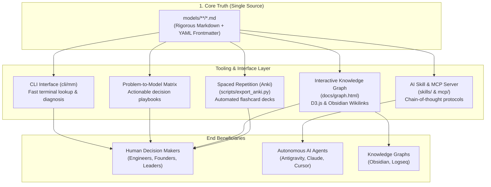

# The Mental Models Latticework

[](LICENSE)
[](models/)
[](#architecture--design-philosophy)
[](mcp/)
[](scripts/validate_models.py)

> **"You can't really know anything if you just remember isolated facts and try and bang 'em back. If the facts don't hang together on a latticework of theory, you don't have them in a usable form."**

An open-source, multidisciplinary knowledge base and decision-support system synthesizing foundational models across physics, evolutionary biology, economics, cognitive psychology, operations research, and mathematics.

Designed from first principles to serve both **human decision-makers** and **autonomous AI agents** without fragmentation.

---

## 🧭 The 5 Pillars of Utility



### 1. The Human Decision Playbook & Problem-to-Model Matrix
Every model file contains a field-tested **Diagnostic Checklist** and **Real-World Case Studies** (Technology, Business, High-Stakes Decisions). When facing a dilemma, consult the matrix below:

| If You Are Facing... | Consult Primary Model | Complementary Pair | Counter-Balance |
| :--- | :--- | :--- | :--- |
| **Deleting or refactoring legacy systems** | [[Chesterton's Fence]] | [[First-Principles Thinking]] | [[Second-Order Thinking]] |
| **Big-bang rewrites vs incremental evolution** | [[Gall's Law]] | [[Theory of Constraints]] | [[Chesterton's Fence]] |
| **High-stakes risk with asymmetric downside** | [[Ergodicity & Absorbing Barriers]] | [[Inversion]] | [[Margin of Safety]] |
| **Runaway positive or negative spirals** | [[Feedback Loops]] | [[Network Effects]] | [[Theory of Constraints]] |
| **Prioritizing roadmap or capital allocation** | [[Opportunity Cost]] | [[Expected Value]] | [[Comparative Advantage]] |
| **Resource allocation across fat tails** | [[Power Laws & The Pareto Principle]] | [[Asymmetric Payoffs]] | [[Theory of Constraints]] |
| **Slow organizational delivery & backlogs** | [[Theory of Constraints]] | [[Feedback Loops]] | [[Leverage]] |
| **Interpersonal friction or vendor breakages** | [[Hanlon's Razor]] | [[Occam's Razor]] | [[Proximate vs Root Cause]] |
| **Rapid competitor adaptation or arms race** | [[The Red Queen Effect]] | [[The OODA Loop]] | [[Economic Moats]] |
| **Hesitation to cut losses on failing projects** | [[Sunk Cost Fallacy]] | [[Loss Aversion]] | [[Opportunity Cost]] |
| **Uncertain forecasts or planning fallacies** | [[Base Rate Fallacy]] | [[Map vs Territory]] | [[Anchoring & Adjustment]] |
| **Designing systems under hostile volatility** | [[Antifragility]] | [[Defense in Depth]] | [[Margin of Safety]] |
| **Shared platform or multi-tenant degradation** | [[Tragedy of the Commons]] | [[Goodhart's Law]] | [[Principal-Agent Problem]] |
| **Navigating live crises under incomplete data** | [[The Fog of War]] | [[The OODA Loop]] | [[Margin of Safety]] |
| **Hiring, credentials, and counterfeit claims** | [[Costly Signaling & The Handicap Principle]] | [[Circle of Competence]] | [[Principal-Agent Problem]] |

---

### 2. AI Agent Reasoning Engine (Skill & MCP Server)
Models are machine-readable with strict YAML frontmatter and dedicated **AI Agent Reasoning Protocols**.
- **Antigravity Skill**: Located at [`skills/mental-models/SKILL.md`](skills/mental-models/SKILL.md). Equip your agent to run multi-model debiasing passes before major refactors.
- **Model Context Protocol (MCP)**: Run [`mcp/server.py`](mcp/server.py) over stdio with Claude Desktop, Cursor, or Antigravity:
  ```json
  {
    "mcpServers": {
      "mental-models": {
        "command": "python3",
        "args": ["/path/to/mental-models/mcp/server.py"]
      }
    }
  }
  ```

---

### 3. "The Latticework" Knowledge Graph
Models do not exist in isolation. Every file connects to others via standard wikilinks (`[[Model Name]]`), compatible with **Obsidian** and **Logseq**.
- **Interactive Force-Directed Graph**: Open [`docs/graph.html`](docs/graph.html) directly in any browser for an interactive D3.js visualization showing **50 interconnected nodes and 114 cross-disciplinary links**.
- **Regenerate Graph**:
  ```bash
  python3 scripts/generate_graph.py
  ```

---

### 4. Zero-Dependency Terminal CLI (`mm`)
Quickly search, diagnose, and review models from your terminal with zero external pip dependencies:

```bash
# List all 50 models organized by category
./cli/mm list

# Search models across titles, summaries, and triggers
./cli/mm search "uncertainty"

# Diagnose a strategic or technical problem statement
./cli/mm diagnose "Our team wants to replace a legacy billing service"

# Show complete details, checklist, and triggers for a model
./cli/mm show chestertons-fence

# Pull a random model for daily reflection
./cli/mm random
```

---

### 5. Spaced Repetition (Anki Flashcards)
Internalize models into long-term intuition. The automated export script extracts conceptual mechanisms and diagnostic scenarios into ready-to-import Anki cards:

```bash
python3 scripts/export_anki.py
```
Outputs `exports/mental_models_anki.tsv` containing **100 flashcards** ready for 1-click import into Anki Desktop / Mobile.

---

## 📚 Categorized Library Index (50 Models)

### 🧠 Core Thinking & Reasoning (12 Models)
- [First-Principles Thinking](models/core_thinking/first-principles.md): Deconstruct to fundamental truths; reason up from scratch.
- [Inversion](models/core_thinking/inversion.md): Approach problems backward; focus on avoiding disaster and stupidity.
- [Second-Order Thinking](models/core_thinking/second-order-thinking.md): "And then what?" Evaluating downstream cascade consequences.
- [Chesterton's Fence](models/core_thinking/chestertons-fence.md): Never remove a rule or structure until you understand why it was built.
- [Occam's Razor](models/core_thinking/occams-razor.md): Select the hypothesis with the fewest unverified assumptions.
- [Hanlon's Razor](models/core_thinking/hanlons-razor.md): Never attribute to malice what is adequately explained by carelessness or fatigue.
- [Map vs. Territory](models/core_thinking/map-vs-territory.md): An abstraction or metric is never the reality it represents.
- [Circle of Competence](models/core_thinking/circle-of-competence.md): Know the perimeter of your genuine expertise and operate inside it.
- [Falsifiability](models/core_thinking/falsifiability.md): Statements must be capable of being proven empirically false to be scientific.
- [Thought Experiments](models/core_thinking/thought-experiments.md): Testing the boundaries of reality through disciplined mental simulation.
- [Steelmanning](models/core_thinking/steelmanning.md): Address the strongest possible version of an opposing argument before critiquing it.
- [Proximate vs. Root Cause](models/core_thinking/proximate-vs-root-cause.md): Distinguish between the surface trigger and underlying systemic vulnerability.

### 🔄 Systems & Complexity (7 Models)
- [Feedback Loops](models/systems_complexity/feedback-loops.md): Circular causality driving exponential growth or homeostatic stability.
- [Theory of Constraints](models/systems_complexity/theory-of-constraints.md): System throughput is strictly dictated by its single narrowest bottleneck.
- [Antifragility](models/systems_complexity/antifragility.md): Systems that gain strength, capability, and resilience from volatility and shocks.
- [Emergence & Self-Organization](models/systems_complexity/emergence.md): Simple local agent interactions generating complex macroscopic behavior.
- [Goodhart's Law](models/systems_complexity/goodharts-law.md): When a measure becomes a target, it ceases to be a good measure.
- [Tragedy of the Commons](models/systems_complexity/tragedy-of-the-commons.md): Rational individual incentives causing collective depletion of shared pools.
- [Gall's Law](models/systems_complexity/galls-law.md): Working complex systems invariably evolved from working simple systems.

### 🎲 Probability & Mathematics (7 Models)
- [Base Rate Fallacy](models/probability_math/base-rate-fallacy.md): Anchoring on vivid anecdotes while ignoring prior statistical baselines.
- [Expected Value](models/probability_math/expected-value.md): Probability-weighted valuation across all possible future branches.
- [Ergodicity & Absorbing Barriers](models/probability_math/ergodicity.md): Distinguishing between ensemble averages and sequential time-average survival.
- [Compounding & Exponential Growth](models/probability_math/compounding.md): Gains reinvested to generate their own returns over long horizons.
- [Power Laws & The Pareto Principle](models/probability_math/power-laws-pareto.md): Scale-free distributions where 20% of inputs drive 80% of outputs.
- [Regression to the Mean](models/probability_math/regression-to-the-mean.md): Extreme outlier performances naturally reverting toward historical averages.
- [Survivorship Bias](models/probability_math/survivorship-bias.md): Focusing on visible survivors while ignoring the silent graveyard of failures.

### 📊 Economics, Strategy & Games (8 Models)
- [Opportunity Cost](models/economics_strategy/opportunity-cost.md): The true cost of any choice is the next best alternative forgone.
- [Asymmetric Payoffs](models/economics_strategy/asymmetric-payoffs.md): Structuring decisions with capped downside and open-ended upside.
- [Network Effects](models/economics_strategy/network-effects.md): Products and protocols becoming quadratically more valuable as nodes increase.
- [Economic Moats](models/economics_strategy/economic-moats.md): Sustainable structural barriers protecting capital returns from competition.
- [Sunk Cost Fallacy](models/economics_strategy/sunk-cost-fallacy.md): Irrationally allocating resources based on unrecoverable past investments.
- [Comparative Advantage](models/economics_strategy/comparative-advantage.md): Maximizing output by specializing where opportunity costs are lowest.
- [Nash Equilibrium & Prisoner's Dilemma](models/economics_strategy/nash-equilibrium.md): Stable game states where no player can unilaterally deviate.
- [Principal-Agent Problem](models/economics_strategy/principal-agent-problem.md): Misaligned incentives between decision-makers and risk-bearers.

### 🧬 Evolution & Biological Systems (3 Models)
- [The Red Queen Effect](models/evolution_biology/red-queen-effect.md): Continuous adaptation required merely to maintain current relative standing.
- [Natural Selection](models/evolution_biology/natural-selection.md): Variation, heritability, and selection pressure driving emergent systemic fitness.
- [Costly Signaling & The Handicap Principle](models/evolution_biology/signaling-theory.md): Signals are reliable only when they are too expensive for a fraud to fake.

### 👤 Psychology & Human Behavior (5 Models)
- [Loss Aversion](models/psychology_cognition/loss-aversion.md): Pain of losses is experienced roughly twice as intensely as equivalent gains.
- [Confirmation Bias](models/psychology_cognition/confirmation-bias.md): Systematically seeking and favoring data that confirms prior beliefs.
- [Social Proof & Informational Cascades](models/psychology_cognition/social-proof.md): Imitating peer behavior in ambiguous situations.
- [Availability Heuristic](models/psychology_cognition/availability-heuristic.md): Estimating frequency and risk by the ease of recalling vivid memories.
- [Anchoring & Adjustment](models/psychology_cognition/anchoring-bias.md): Over-relying on the first number or frame encountered in negotiations.

### ⚙️ Physics & Engineering (5 Models)
- [Margin of Safety](models/physics_engineering/margin-of-safety.md): Designing buffer capacity to absorb unexpected stresses and unknown unknowns.
- [Thermodynamics & Entropy](models/physics_engineering/entropy.md): Isolated systems naturally decay toward disorder without energy input.
- [Critical Mass](models/physics_engineering/critical-mass.md): Minimum concentration required to ignite a self-sustaining chain reaction.
- [Leverage](models/physics_engineering/leverage.md): Using advantageous fulcrums to multiply force, code, and capital impact.
- [Activation Energy & Catalysts](models/physics_engineering/activation-energy.md): Lowering initial friction hurdles to ignite spontaneous reactions.

### ⚡ Operations & High-Stakes Strategy (3 Models)
- [The OODA Loop](models/operations_strategy/ooda-loop.md): Observe, Orient, Decide, Act—cycling faster than the environment to dictate outcomes.
- [Defense in Depth](models/operations_strategy/defense-in-depth.md): Layering independent protective controls to eliminate single points of failure.
- [The Fog of War](models/operations_strategy/fog-of-war.md): Decisive operational execution through epistemic ambiguity and incomplete telemetry.

---

## 🛠️ Repository Architecture

```text
mental-models/
├── .github/workflows/ci.yml       # Automated CI schema & CLI test suite
├── cli/
│   ├── mm                         # Executable CLI entrypoint (ANSI formatted)
│   └── mm_core.py                 # Core parsing, search, and diagnosis engine
├── docs/
│   └── graph.html                 # Standalone interactive D3.js knowledge graph
├── exports/
│   └── mental_models_anki.tsv     # Generated Anki flashcard deck (100 cards)
├── mcp/
│   └── server.py                  # JSON-RPC Model Context Protocol server
├── models/                        # THE SINGLE SOURCE OF TRUTH (50 models)
│   ├── core_thinking/             # 12 models
│   ├── economics_strategy/        # 8 models
│   ├── evolution_biology/         # 3 models
│   ├── operations_strategy/       # 3 models
│   ├── physics_engineering/       # 5 models
│   ├── probability_math/          # 7 models
│   ├── psychology_cognition/      # 5 models
│   └── systems_complexity/        # 7 models
├── scripts/
│   ├── export_anki.py             # Generates Spaced Repetition decks
│   ├── generate_graph.py          # Builds force-directed D3 graph
│   └── validate_models.py         # Validates frontmatter & link schema
├── skills/
│   └── mental-models/SKILL.md     # Antigravity / AI Agent skill specification
├── templates/
│   └── model-template.md          # Standard schema for adding new models
├── CONTRIBUTING.md
├── LICENSE                        # MIT License
└── README.md
```

---

## 🧪 Schema Validation & CI

All model contributions must conform to the strict schema checked by our validation script:

```bash
python3 scripts/validate_models.py
```

Checks performed:
- Valid YAML frontmatter (`id`, `title`, `domain`, `category`, `summary`, `triggers`, `counter_models`, `paired_models`).
- Presence of all required sections: Core Intuition, Diagnostic Checklist, Real-World Case Studies, Failure Modes, The Latticework, AI Protocol.
- Integrity of inter-model references.

---

## 🤝 Contributing

Contributions of new mental models or refinements to existing ones are warmly welcome! Please review [CONTRIBUTING.md](CONTRIBUTING.md) and use [templates/model-template.md](templates/model-template.md) as the blueprint.

---

## 📄 License

This project is licensed under the [MIT License](LICENSE) &copy; 2026 Gabriel Rondon.
