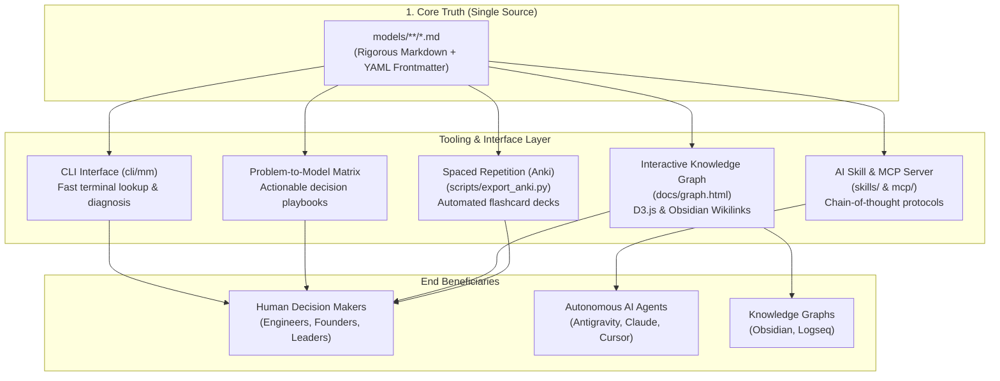

# The Mental Models Latticework

[](LICENSE)
[](models/)
[](#architecture--design-philosophy)
[](mcp/)
[](scripts/validate_models.py)

> **"You can't really know anything if you just remember isolated facts and try and bang 'em back. If the facts don't hang together on a latticework of theory, you don't have them in a usable form."**

An open-source, multidisciplinary knowledge base and decision-support system synthesizing foundational models across physics, evolutionary biology, economics, cognitive psychology, operations research, and mathematics.

Designed from first principles to serve both **human decision-makers** and **autonomous AI agents** without fragmentation.

---

## 🧭 The 5 Pillars of Utility



### 1. The Human Decision Playbook & Problem-to-Model Matrix
Every model file contains a field-tested **Diagnostic Checklist** and **Real-World Case Studies** (Technology, Business, High-Stakes Decisions). When facing a dilemma, consult the matrix below:

| If You Are Facing... | Consult Primary Model | Complementary Pair | Counter-Balance |
| :--- | :--- | :--- | :--- |
| **Deleting or refactoring legacy systems** | [[Chesterton's Fence]] | [[First-Principles Thinking]] | [[Second-Order Thinking]] |
| **High-stakes risk with asymmetric downside** | [[Ergodicity]] | [[Inversion]] | [[Margin of Safety]] |
| **Runaway positive or negative spirals** | [[Feedback Loops]] | [[Network Effects]] | [[Theory of Constraints]] |
| **Prioritizing roadmap or capital allocation** | [[Opportunity Cost]] | [[Expected Value]] | [[Theory of Constraints]] |
| **Slow organizational delivery & backlogs** | [[Theory of Constraints]] | [[Feedback Loops]] | [[Margin of Safety]] |
| **Interpersonal friction or vendor breakages** | [[Hanlon's Razor]] | [[Occam's Razor]] | [[Map vs Territory]] |
| **Rapid competitor adaptation or arms race** | [[The Red Queen Effect]] | [[The OODA Loop]] | [[Antifragility]] |
| **Hesitation to cut losses on failing projects** | [[Loss Aversion]] | [[Expected Value]] | [[Opportunity Cost]] |
| **Uncertain forecasts or planning fallacies** | [[Base Rate Fallacy]] | [[Map vs Territory]] | [[Margin of Safety]] |
| **Designing systems under hostile volatility** | [[Antifragility]] | [[Asymmetric Payoffs]] | [[Margin of Safety]] |

---

### 2. AI Agent Reasoning Engine (Skill & MCP Server)
Models are machine-readable with strict YAML frontmatter and dedicated **AI Agent Reasoning Protocols**.
- **Antigravity Skill**: Located at [`skills/mental-models/SKILL.md`](skills/mental-models/SKILL.md). Equip your agent to run multi-model debiasing passes before major refactors.
- **Model Context Protocol (MCP)**: Run [`mcp/server.py`](mcp/server.py) over stdio with Claude Desktop, Cursor, or Antigravity:
  ```json
  {
    "mcpServers": {
      "mental-models": {
        "command": "python3",
        "args": ["/path/to/mental-models/mcp/server.py"]
      }
    }
  }
  ```

---

### 3. "The Latticework" Knowledge Graph
Models do not exist in isolation. Every file connects to others via standard wikilinks (`[[Model Name]]`), compatible with **Obsidian** and **Logseq**.
- **Interactive Force-Directed Graph**: Open [`docs/graph.html`](docs/graph.html) directly in any browser for an interactive D3.js visualization showing clusters, paired bonds (solid blue), and counter-balances (dashed pink).
- **Regenerate Graph**:
  ```bash
  python3 scripts/generate_graph.py
  ```

---

### 4. Zero-Dependency Terminal CLI (`mm`)
Quickly search, diagnose, and review models from your terminal with zero external pip dependencies:

```bash
# List all models organized by category
./cli/mm list

# Search models across titles, summaries, and triggers
./cli/mm search "uncertainty"

# Diagnose a strategic or technical problem statement
./cli/mm diagnose "Our team wants to replace a legacy billing service"

# Show complete details, checklist, and triggers for a model
./cli/mm show chestertons-fence

# Pull a random model for daily reflection
./cli/mm random
```

---

### 5. Spaced Repetition (Anki Flashcards)
Internalize models into long-term intuition. The automated export script extracts conceptual mechanisms and diagnostic scenarios into ready-to-import Anki cards:

```bash
python3 scripts/export_anki.py
```
Outputs `exports/mental_models_anki.tsv` ready for 1-click import into Anki Desktop / Mobile.

---

## 📚 Categorized Library Index

### 🧠 Core Thinking & Reasoning
*Foundational epistemology, logic, and cognitive heuristics.*
- [First-Principles Thinking](models/core_thinking/first-principles.md): Deconstruct to fundamental truths; reason up from scratch.
- [Inversion](models/core_thinking/inversion.md): Approach problems backward; focus on avoiding disaster and stupidity.
- [Second-Order Thinking](models/core_thinking/second-order-thinking.md): "And then what?" Evaluating downstream cascade consequences.
- [Chesterton's Fence](models/core_thinking/chestertons-fence.md): Never remove a rule or structure until you understand why it was built.
- [Occam's Razor](models/core_thinking/occams-razor.md): Select the hypothesis with the fewest unverified assumptions.
- [Hanlon's Razor](models/core_thinking/hanlons-razor.md): Never attribute to malice what is adequately explained by carelessness or fatigue.
- [Map vs. Territory](models/core_thinking/map-vs-territory.md): An abstraction or metric is never the reality it represents.

### 🔄 Systems & Complexity
*Non-linear dynamics, feedback, and structural emergence.*
- [Feedback Loops](models/systems_complexity/feedback-loops.md): Circular causality driving exponential growth or homeostatic stability.
- [Theory of Constraints](models/systems_complexity/theory-of-constraints.md): System throughput is strictly dictated by its single narrowest bottleneck.
- [Antifragility](models/systems_complexity/antifragility.md): Systems that gain strength, capability, and resilience from volatility and shocks.

### 🎲 Probability & Mathematics
*Rational expectation, priors, and survival under uncertainty.*
- [Base Rate Fallacy](models/probability_math/base-rate-fallacy.md): Anchoring on vivid anecdotes while ignoring prior statistical baselines.
- [Expected Value](models/probability_math/expected-value.md): Probability-weighted valuation across all possible future branches.
- [Ergodicity & Absorbing Barriers](models/probability_math/ergodicity.md): Distinguishing between ensemble averages and sequential time-average survival.

### 📊 Economics, Strategy & Games
*Incentives, payoffs, moats, and trade-offs.*
- [Opportunity Cost](models/economics_strategy/opportunity-cost.md): The true cost of any choice is the next best alternative forgone.
- [Asymmetric Payoffs](models/economics_strategy/asymmetric-payoffs.md): Structuring decisions with capped downside and open-ended upside.
- [Network Effects](models/economics_strategy/network-effects.md): Products and protocols becoming quadratically more valuable as nodes increase.

### 🧬 Evolution & Biological Systems
*Adaptive landscapes, co-evolution, and systemic survival.*
- [The Red Queen Effect](models/evolution_biology/red-queen-effect.md): Continuous adaptation required merely to maintain current relative standing.

### 👤 Psychology & Human Behavior
*Cognitive biases, emotional asymmetries, and social dynamics.*
- [Loss Aversion](models/psychology_cognition/loss-aversion.md): Pain of losses is experienced roughly twice as intensely as equivalent gains.

### ⚙️ Physics & Engineering
*Structural invariants, capacity buffering, and physical limits.*
- [Margin of Safety](models/physics_engineering/margin-of-safety.md): Designing buffer capacity to absorb unexpected stresses and unknown unknowns.

### ⚡ Operations & High-Stakes Strategy
*Tempo, decision loops, and operational agility.*
- [The OODA Loop](models/operations_strategy/ooda-loop.md): Observe, Orient, Decide, Act—cycling faster than the environment to dictate outcomes.

---

## 🛠️ Repository Architecture

```text
mental-models/
├── .github/workflows/ci.yml       # Automated CI schema & CLI test suite
├── cli/
│   ├── mm                         # Executable CLI entrypoint (ANSI formatted)
│   └── mm_core.py                 # Core parsing, search, and diagnosis engine
├── docs/
│   └── graph.html                 # Standalone interactive D3.js knowledge graph
├── exports/
│   └── mental_models_anki.tsv     # Generated Anki flashcard deck
├── mcp/
│   └── server.py                  # JSON-RPC Model Context Protocol server
├── models/                        # THE SINGLE SOURCE OF TRUTH
│   ├── core_thinking/
│   ├── economics_strategy/
│   ├── evolution_biology/
│   ├── operations_strategy/
│   ├── physics_engineering/
│   ├── probability_math/
│   ├── psychology_cognition/
│   └── systems_complexity/
├── scripts/
│   ├── export_anki.py             # Generates Spaced Repetition decks
│   ├── generate_graph.py          # Builds force-directed D3 graph
│   └── validate_models.py         # Validates frontmatter & link schema
├── skills/
│   └── mental-models/SKILL.md     # Antigravity / AI Agent skill specification
├── templates/
│   └── model-template.md          # Standard schema for adding new models
├── CONTRIBUTING.md
├── LICENSE                        # MIT License
└── README.md
```

---

## 🧪 Schema Validation & CI

All model contributions must conform to the strict schema checked by our validation script:

```bash
python3 scripts/validate_models.py
```

Checks performed:
- Valid YAML frontmatter (`id`, `title`, `domain`, `category`, `summary`, `triggers`, `counter_models`, `paired_models`).
- Presence of all required sections: Core Intuition, Diagnostic Checklist, Real-World Case Studies, Failure Modes, The Latticework, AI Protocol.
- Integrity of inter-model references.

---

## 🤝 Contributing

Contributions of new mental models or refinements to existing ones are warmly welcome! Please review [CONTRIBUTING.md](CONTRIBUTING.md) and use [templates/model-template.md](templates/model-template.md) as the blueprint.

---

## 📄 License

This project is licensed under the [MIT License](LICENSE) &copy; 2026 Gabriel Rondon.
